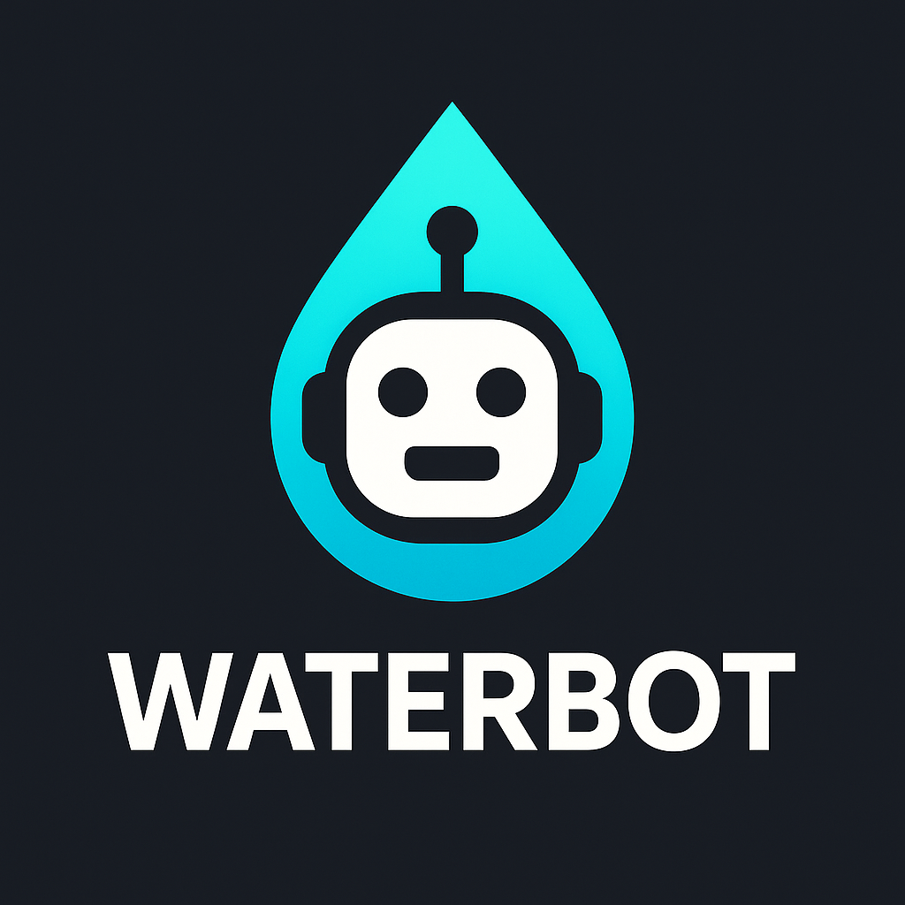

# WaterBot - Discord GPIO Controller for Raspberry Pi

[](https://github.com/fclaude/waterbot/actions/workflows/ci.yml)
[](https://codecov.io/gh/fclaude/waterbot)
[](https://www.python.org/downloads/)
[](https://github.com/psf/black)
[](https://opensource.org/licenses/MIT)



A Python bot that uses Discord to control GPIO pins on a Raspberry
Pi Zero W. The bot only responds to messages from a specific Discord channel.

## Features

- Control GPIO pins remotely via Discord
- Secure: only responds to messages from a specified Discord channel
- Command-based interface to control devices
- Timed operations (e.g., turn on a device for 1 hour)
- **Automatic scheduling**: Set devices to turn on/off at specific times
- Emulation mode for testing on non-RPi devices
- Configurable device-to-pin mapping via .env file
- Comprehensive unit test coverage

## Requirements

- Python 3.7+
- Raspberry Pi Zero W (or any Raspberry Pi)
- Discord bot token
- Discord server with a channel for the bot

## Installation

1. Clone this repository:

```bash
git clone https://github.com/yourusername/waterbot.git
cd waterbot
```

1. Install the required packages:

```bash
pip install -r requirements.txt
```

1. Create a `.env` file with your configuration:

```env
# Discord Configuration
DISCORD_BOT_TOKEN="your_discord_bot_token_here"
DISCORD_CHANNEL_ID="123456789012345678"

# Operation Mode (rpi or emulation)
OPERATION_MODE=rpi

# Device to GPIO Pin Mapping
# Format: DEVICE_NAME=GPIO_PIN_NUMBER
DEVICE_LIGHT=17
DEVICE_FAN=18
DEVICE_PUMP=27
DEVICE_HEATER=22

# Default timeout in seconds (optional, for timed operations)
DEFAULT_TIMEOUT=3600

# Scheduling Configuration
# Enable automatic scheduling of devices
ENABLE_SCHEDULING=true
# JSON file to store schedule configuration (optional)
SCHEDULE_CONFIG_FILE=schedules.json

# Schedule Configuration (alternative to JSON file)
# Format: SCHEDULE_<DEVICE>_<ACTION>=HH:MM[,HH:MM,...]
# Examples:
# SCHEDULE_PUMP_ON=08:00,20:00
# SCHEDULE_PUMP_OFF=12:00,23:00
# SCHEDULE_LIGHT_ON=06:30
# SCHEDULE_LIGHT_OFF=22:00
```

### Discord Bot Setup

This bot uses Discord's bot API to communicate. Follow these steps to set up
your Discord bot:

1. Create a Discord Application at the
   [Discord Developer Portal](https://discord.com/developers/applications)
2. Create a bot user in your application
3. Copy the bot token and add it to your `.env` file as `DISCORD_BOT_TOKEN`
4. Invite the bot to your Discord server with appropriate permissions:
   - Send Messages
   - Read Message History
   - Use Slash Commands
5. Get your Discord channel ID (enable Developer Mode in Discord,
   right-click channel, Copy ID)
6. Update your `.env` file with the channel ID

## Usage

### Starting the Bot

```bash
python -m waterbot.bot
```

### Available Commands

Send these commands from the Discord channel to control your devices:

#### Device Control

- `status` - Show the status of all devices
- `on <device>` - Turn on a specific device
- `off <device>` - Turn off a specific device
- `on <device> <seconds>` - Turn on a device for a specified time
- `off <device> <seconds>` - Turn off a device for a specified time
  - `on all` - Turn on all devices
  - `off all` - Turn off all devices

#### Scheduling Commands

- `schedules` - Show all configured schedules and next runs
- `schedule <device> <on|off> <HH:MM>` - Add a new schedule
- `unschedule <device> <on|off> <HH:MM>` - Remove a schedule

#### Help

- Send any unrecognized command to get help

### Examples

#### Basic Device Control

```text
status
on light
off pump
on fan 3600
off heater 1800
on all
off all
```

#### Scheduling Examples

```text
# Show all schedules
schedules

# Turn on pump at 8:00 AM and 8:00 PM every day
schedule pump on 08:00
schedule pump on 20:00

# Turn off pump at 12:00 PM and 11:00 PM every day
schedule pump off 12:00
schedule pump off 23:00

# Turn on lights at 6:30 AM
schedule light on 06:30

# Turn off lights at 10:00 PM
schedule light off 22:00

# Remove a schedule
unschedule pump on 20:00
```

## Development and Testing

For development and testing on non-RPi devices, set
`OPERATION_MODE=emulation` in your `.env` file. In this mode, GPIO
operations will be simulated and printed to the console.

### Running Tests

The project includes comprehensive unit tests. To run the tests:

```bash
# Install test dependencies
pip install -r requirements.txt

# Run all tests
pytest

# Run tests with coverage report
pytest --cov=waterbot --cov-report=html

# Run specific test file
pytest tests/test_gpio_handler.py

# Run tests matching a pattern
pytest -k "test_device"
```

### Test Coverage

The test suite covers:

- GPIO interface and hardware abstraction
- Device control logic and timing
- Schedule configuration and management
- Discord bot message handling
- Command parsing and validation
- Error handling and edge cases

### Testing Configuration

Tests use mock objects and dependency injection to ensure they can run
without hardware dependencies or external services.

## CI/CD Integration

WaterBot includes comprehensive CI/CD pipelines for automated testing and deployment:

### GitLab CI/CD

- Automated testing on every commit and merge request
- Multi-Python version testing (3.8-3.11)
- Code quality checks (linting, formatting, type checking)
- Security vulnerability scanning
- Docker image building and testing

### GitHub Actions

- Similar comprehensive pipeline for GitHub repositories
- Automatic PyPI publishing on releases
- Codecov integration for coverage reporting

See [CI-CD.md](CI-CD.md) for detailed pipeline documentation.

## Running as a Service

To run the bot as a systemd service on your Raspberry Pi, follow these
comprehensive steps:

### Prerequisites

1. **Ensure you have a dedicated user for the service** (recommended for
   security):

```bash
# Create a dedicated user for the bot (optional but recommended)
sudo useradd -r -s /bin/false -d /opt/waterbot waterbot-service

# Or use the default 'pi' user if you prefer
```

1. **Add the service user to the gpio group** (for GPIO access):

```bash
# If using dedicated user:
sudo usermod -a -G gpio waterbot-service

# If using pi user:
sudo usermod -a -G gpio pi
```

### Installation for Service

1. **Install the bot in a system location** (recommended):

```bash
# Create application directory
sudo mkdir -p /opt/waterbot
sudo chown $USER:$USER /opt/waterbot

# Clone and setup the application
cd /opt/waterbot
git clone https://github.com/yourusername/waterbot.git .
```

1. **Install Python dependencies**:

```bash
# Install system-wide or in a virtual environment
sudo pip3 install -r requirements.txt

# Or create a virtual environment (recommended):
python3 -m venv /opt/waterbot/venv
sudo chown -R waterbot-service:waterbot-service /opt/waterbot
source /opt/waterbot/venv/bin/activate
pip install -r requirements.txt
```

1. **Setup configuration**:

```bash
# Create and configure the .env file
sudo cp .env.example .env  # if you have an example file
sudo nano /opt/waterbot/.env

# Ensure proper ownership
sudo chown waterbot-service:waterbot-service /opt/waterbot/.env
sudo chmod 600 /opt/waterbot/.env  # Secure the config file
```

1. **Configure Discord bot credentials for the service user**:

```bash
# Ensure the .env file contains proper Discord configuration
# DISCORD_BOT_TOKEN and DISCORD_CHANNEL_ID should be set
# The service user should have read access to this file
```

### Creating the Service

1. **Create the systemd service file**:

```bash
sudo nano /etc/systemd/system/waterbot.service
```

1. **Add the service configuration**:

```ini
[Unit]
Description=WaterBot Discord GPIO Controller
After=network.target
Wants=network-online.target

[Service]
Type=simple
User=waterbot-service
Group=waterbot-service
WorkingDirectory=/opt/waterbot
Environment=PATH=/opt/waterbot/venv/bin:/usr/local/bin:/usr/bin:/bin

# Use virtual environment if created
ExecStart=/opt/waterbot/venv/bin/python -m waterbot.bot
# Or use system Python
# ExecStart=/usr/bin/python3 -m waterbot.bot

# Restart configuration
Restart=always
RestartSec=10
StartLimitInterval=60
StartLimitBurst=3

# Security settings
NoNewPrivileges=true
PrivateTmp=true
ProtectSystem=strict
ProtectHome=true
ReadWritePaths=/opt/waterbot

# Logging
StandardOutput=journal
StandardError=journal
SyslogIdentifier=waterbot

[Install]
WantedBy=multi-user.target
```

**Note**: If using the `pi` user instead of a dedicated user, change `User=pi`
and `Group=pi` in the service file, and adjust paths accordingly (e.g.,
`/home/pi/waterbot`).

### Managing the Service

1. **Reload systemd and enable the service**:

```bash
sudo systemctl daemon-reload
sudo systemctl enable waterbot.service
```

1. **Start the service**:

```bash
sudo systemctl start waterbot.service
```

1. **Check service status**:

```bash
sudo systemctl status waterbot.service
```

1. **View service logs**:

```bash
# View recent logs
sudo journalctl -u waterbot.service -f

# View logs from specific time
sudo journalctl -u waterbot.service --since "1 hour ago"

# View all logs for the service
sudo journalctl -u waterbot.service --no-pager
```

### Troubleshooting

**Common issues and solutions:**

1. **Permission denied errors**:
   - Ensure the service user is in the `gpio` group
   - Check file ownership and permissions for the bot directory
   - Verify the .env file is accessible to the service user

2. **Discord bot not working**:
   - Ensure the Discord bot token is valid and properly configured
   - Check that the bot has permissions in the Discord channel
   - Verify the Discord channel ID is correct

3. **Module import errors**:
   - Ensure all dependencies are installed in the correct Python environment
   - Check that the PYTHONPATH includes the waterbot directory
   - Verify the virtual environment path (if used) is correct

4. **Service won't start**:
   - Check the service logs: `sudo journalctl -u waterbot.service`
   - Verify all file paths in the service configuration
   - Test the bot manually first: `python3 -m waterbot.bot`

5. **GPIO access issues**:
   - Ensure the service user is in the `gpio` group:
     `groups waterbot-service`
   - Check that GPIO pins are not being used by other processes
   - Verify the device-to-pin mapping in your .env file

### Service Management Commands

```bash
# Start the service
sudo systemctl start waterbot.service

# Stop the service
sudo systemctl stop waterbot.service

# Restart the service
sudo systemctl restart waterbot.service

# Enable service to start on boot
sudo systemctl enable waterbot.service

# Disable service from starting on boot
sudo systemctl disable waterbot.service

# Check if service is running
sudo systemctl is-active waterbot.service

# View service configuration
sudo systemctl show waterbot.service
```
